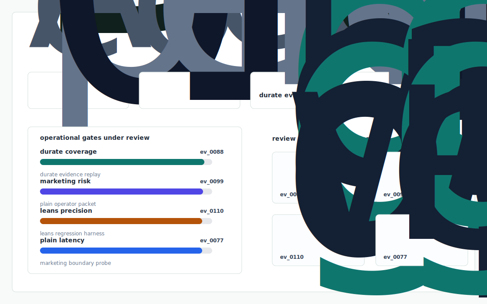
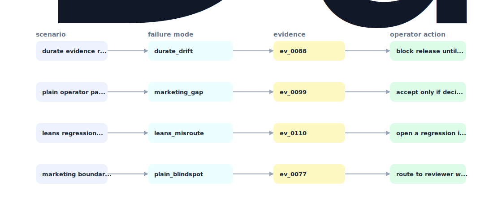

# Residency Rule Preflight Preflight

A compliance pre flight layer for Residency Rule Preflight that converts plain English rules into typed constraints, statically proves every published schedule against the ACGME Common Program Requirements + specialty supplements, and produces an auditor ready PDF showing exactly which rule check passed which clause.



## Why it exists

Residency Rule Preflight's marketing leans on "plain English" rule configuration (YC profile). For residency programs the rule set is non trivial: the ACGME Common Program Requirements for Residency 2025 (acgme.org) defines specific maximum hour rules (80h/wk averaged over 4 weeks, 24+4 max continuous, 14h off after 24, 1 in 7 free, in house call no more frequent than.

The project is intentionally built as a local replay harness instead of a slide. It creates fixtures, plants realistic failure modes, produces citation-locked evidence, and turns the result into a dashboard a reviewer can inspect without credentials or hosted services.

## What is inside

- Deterministic fixture generation for the company-specific risk surface.
- Strategy code in `src/Residency Rule Preflight_preflight/strategy.py` with project-specific scoring and visual evidence.
- Citation-locked reports where every decision claim points to a generated evidence ID.
- Two regenerated visual artifacts: `outputs/project_working.svg` and `outputs/evidence_map.svg`.
- A portable demo pack with JSON, CSV, Markdown, HTML, SVG, benchmark, and test artifacts.



## Signals it measures

- `Residency Rule Preflight coverage`
- `marketing risk`
- `leans precision`
- `plain latency`

## Failure modes it plants

- Residency Rule Preflight drift
- marketing gap
- leans misroute
- plain blindspot

## Run it locally

```bash
uv sync
uv run Residency Rule Preflight-preflight all
uv run pytest -q
uv run ruff check .
```

## Outputs worth opening

- `outputs/dashboard.html`
- `outputs/project_working.svg`
- `outputs/evidence_map.svg`
- `outputs/operator_brief.md`
- `outputs/decision_report.md`
- `outputs/strategy_model.json`
- `outputs/demo_pack.zip`

## Boundary

Everything runs locally against synthetic fixtures. There are no credentials, no customer records, no outreach files, and no hosted API dependency.
